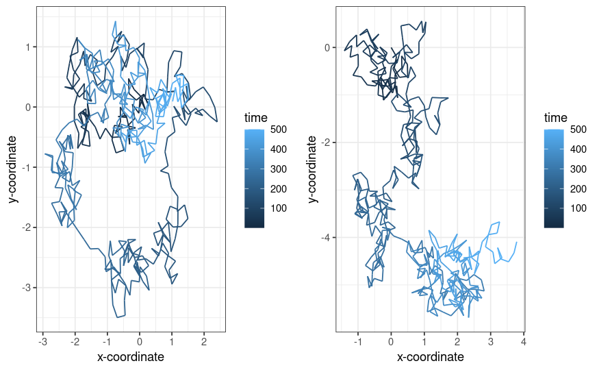
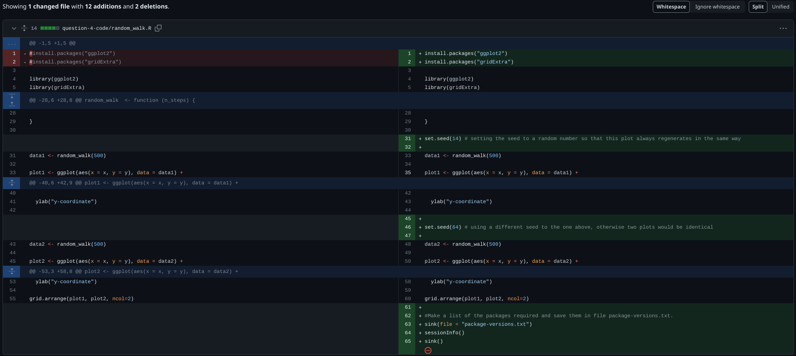
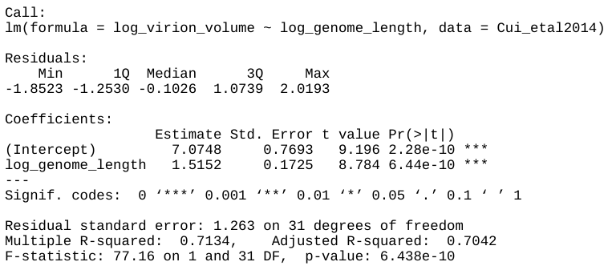
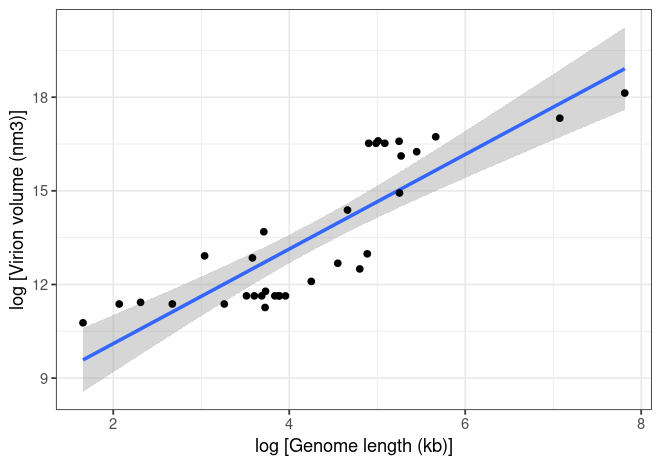

# Question 1, 2, & 3
Can be found in the README.Rmd file in the logistic_growth repository 

# Question 4 - Brownian Motion 

```{r, echo = FALSE, message=FALSE, warning=FALSE}
# Installing the necessary packages
library(ggplot2)
library(gridExtra)
library(dplyr)
library(readr)
```

### 1) Execute the code to produce the paths of two random walks. What do you observe?

The script provided in the *'random_walk'* file produces the two plots below.



Brownian motion is the random movement of suspended particles, with fast moving molecules or atoms that hit the particles being the cause of this random motion. It is a continuous time stochastic process, as it gives a randomly determined outcome. 

In these plots, I can observe the path taken by the randomly generated walks through time, with earlier time points shown in darker colours. Both walks contain 500 steps, but we can see a difference between the two graphs: the one of the left tends to have longer walks, and so talks up more of the grid space, in comparison to the shorter walks which cover less of the right hand grid. This demonstrates the randomness of the movement of a particle in a 2D space across time. 

### 2) Investigate the term random seeds. What is a random seed and how does it work?

In R Studio, a seed is a way to create reproducible results when creating code with random-number variables. Using a random seed as a starting point to generating random numbers is crucial when generating reproducible random sequences. By setting a random seed, one can ensure that the sequence of random numbers generated by a program is the same every time it runs, given the same initial seed. It is done using the set.seed(seed) function, where (seed) is replaced by a number. This has particular importance when generating code that must be reproducible, for example in statistical analyses, or when attempting to debug code that uses random numbers.  

### 3) Edit the script to make a reproducible simulation of Brownian motion. Commit the file and push it to your forked reproducible-research homework repo

The edited script can be found in the 'question-4-code/random_walk.R file'

### 4) Go to your commit history and click on the latest commit. Show the edit you made to the code in the comparison view (add this image to the README.md of the fork)



# Question 5

### 1) Import the data for double-stranded DNA (dsDNA) viruses taken from the Supplementary Materials of the original paper into Posit Cloud. How many rows and columns does the table have?

```{r, warning=FALSE, message=FALSE}
Cui_etal2014 <- read_csv("Cui_etal2014.csv")
View(Cui_etal2014)
```
The table has 33 rows and 13 columns

**Cleaning the data**

The dataset has very user unfriendly names, including spaces and a mix of capital letters, so before working on it I will firstly clean it so that it can be manipulated with greater ease. 
```{r, warning=FALSE}
cuietal_clean <- rename(Cui_etal2014, genome_length = "Genome length (kb)", virion_volume = "Virion volume (nm×nm×nm)")
names(cuietal_clean)
```


```{r, echo=FALSE, message=FALSE, results='hide', error=FALSE}
# Saving the data in a 'data' folder 
dir.create("data")
write.csv(Cui_etal2014, "data/Cui_etal2014.csv")
write.csv(cuietal_clean, "data/cuietal_clean.csv")
```

### 2) What transformation can you use to fit a linear model to the data? Apply the transformation. 
To fit a linear model to the data, I applied a log transformation to virion volume and genome length, as these two properties have such wide ranges (5.24 to 2473.87kb for genome length and 321392 to 75000000nm2 for virion volume)
```{r}
cuietal_clean$log_virion_volume <- log(cuietal_clean$virion_volume)
cuietal_clean$log_genome_length <- log(cuietal_clean$genome_length)

# Checking that these log models have been applied to the clean dataset
names(cuietal_clean)
# log_virion_volume and log_genome_length have been added 
```

**Find the exponent (α) and scaling factor (β) of the allometric law for dsDNA viruses and write the p-values from the model you obtained, are they statistically significant? Compare the values you found to those shown in Table 2 of the paper, did you find the same values?**

Viral particle volume can be predicted by their genome length using the allometric equation V = βL^α. Therefore to find the values of alpha (representing the exponent) and beta (the scaling factor), it was first necessary to apply a linear regression to the two variables, virion volume in nm3 and genome length in nucleotides. This was done using the code below. 

```{r, results='hide'}
linear_model <- lm(data = cuietal_clean, log_virion_volume~log_genome_length)
summary(linear_model)
```



In this formula, log(V)=β+α*log(L). β is the intercept, and α is the value provided for log_genome_length. Therefore, the value of the exponent (α) is 1.5152, and that of the scaling factor (β) is 7.0748. These values are highly significant in explaining the relationship between virion volume (V) and genome length (L), denoted by a three star significance code. 

So, this linear model suggests a relationship between the log of virus length and the log of genome length: V = βL^α, where β ≈ 7.0748 and α ≈ 1.5152
- V ≈ 7.0748L^1.5152

From table 2 in the paper, the value of the exponent for dsDNA was recorded as 1.52, which is the same value to 2 significant figures as the value I found. The scaling factor in the paper was given as 1,182 for dsDNA, which, if we logarithmically backtransform our value of 7.0748 (e^7.0748) to give 1181.8071, is very similar to. 

### 3) Write the code to reproduce the figure shown below
```{r, results='hide', message=FALSE, warning=FALSE, fig.keep='none'}
# Load necessary packages
library(ggplot2)
library(janitor)
library(dplyr)
library(data.table)


# Subsetting the cleaned dataset to include only the columns we need 
cuietal_subset <- cuietal_clean[, c("genome_length", "virion_volume")]
View(cuietal_subset)
write.csv(cuietal_subset, "data/cuietal_subset.csv")


# Log-transforming the variables genome length and virion volume so I can do a linear regression 
cuietal_subset$log_virion_volume <- log(cuietal_subset$virion_volume)
cuietal_subset$log_genome_length <- log(cuietal_subset$genome_length)
View(cuietal_subset) # checking these extra log-transformed variables have been added 


# Setting up the linear model 
linear_model <- lm(data = cuietal_subset, log_virion_volume~log_genome_length)
summary(linear_model) 
# This summary yields the same results as in the previous parts to this question

# Plotting the log-transformed data 
ggplot(data = cuietal_clean, aes(x= log_genome_length, y = log_virion_volume)) +
    geom_smooth(method = "lm", se = TRUE) +
    theme_bw()+
    labs(x = "log [Genome length (kb)]", y = "log [Virion volume (nm3)]") +
    geom_point()
```



**Bonus (10 points) Explain the difference between reproducibility and replicability in scientific research. How can git and GitHub be used to enhance the reproducibility and replicability of your work? What limitations do they have? (e.g. check the platform protocols.io).**

A study may be said to be reproducible when its data can be reanalysed using the same metholody, and leads to the same results. Reproducibility therefore does not show whether results are correct, as no new data is collected. It does however allow results to be transparent, as anyone with the data can run the analysis themselves to produce the same results. 
  In contrast, a study is replicable when the whole process of collecting and analysing data is repeated, leading to new data, but the same results. This process tests how robust the findings are when tested under slightly different conditions, and therefore can validate or invalidate the original results by exploring whether they hold true under altered circumstances. 
  Both  high reproducibility and replicability are critical for the credibility and reliability of scientific research, as they give greater support to the validity of the study's conclusions. 

Git is a widely used version control system, as it allows uses to track their changes to files and to collaborate with many other users, and GitHub is a hosting service for Git repositories. Both are important platforms to use for producing reproducible and replicable pieces of work. One of the key roles of git is version control: the ability to store different versions of one's work. Git tracks changes in files, and keeps a detailed record of all changes made. This makes the code transparent, as others can see how it was created, and reproducible, as other can then re-run the analyses. Furthermore, the ability to create forks in git allows researchers to experiment with different versions of a project without commiting any changes to the main project. This increases the replicability of the work, as it allows others to see all of the different variations of the project. 
  GitHub is a key platform for hosting the git repositories, where it acts as a central hub for all work. This allows various project files, including code, datasets, and different documentation to be stored in one place. GitHub also allows research to be shared and collaborated on, as by hosting others on a project, they are able to not only view the work as it is being completed, but even contribute. 
  
  Whilst these platforms are very beneficial to improving the reproducability and replicabiltiy of code, they do have their limitations. For example, they have limitations on the accessibility of sensitive or proprietary information, meaning users may be required to purchase premium plans for increased privacy. They also have limitations in terms of storage capacities, and this could be restrictive when dealing with projects with particularly large files or datasets. Finally, the cloud-based interfaces, such as GitHub and Posit Cloud require internet access, and so are vulnerable to internet disruptions. Protocols.io is an online platform designed for documenting and sharing research protocols and experimental methodologies. It can be used in tandem with GitHub to improve the reproducibility of studies. For example, by integrating documented protocols from Protocols.io with GitHub repositories, so that the detailed experimental procedures can be found with the code and data, allowing others to replicate experiments more accurately. Furthermore, this will allow other collaborators to better understand the methodologies used in the project, thus increasing transparency. Therefore, by using Protocols.io in tandem with GitHub, we can produce more detailed experimental procedures in combination with the code and project repositories.
  
 

```{r, echo=FALSE, message=FALSE, results='hide'}
# Placing all images inside an 'image' folder
dir.create("images")
file.rename("commit_changes.png", "images/commit_changes.png")

# Placing all figures inside a 'figure' folder
dir.create("figures")
file.rename("images/brownian_motion.png", "figures/brownian_motion.png")
file.rename("images/reproducedfigure.png", "figures/reproducedfigure.png")
file.rename("images/virionmodel.png", "figures/virionmodel.png")
file.rename("images/Rplot.png", "figures/Rplot.png")
```